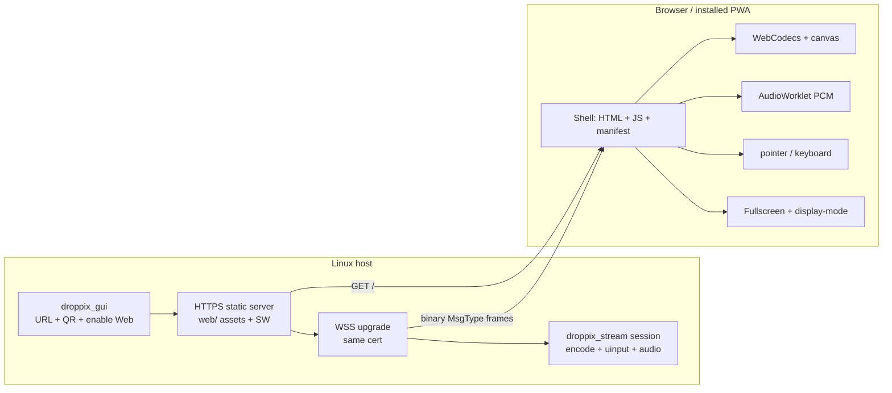

# Web PWA client (host-served) — Design

**Date:** 2026-07-18  
**Status:** Implemented on `feat/web-pwa-client` (2026-07-18). Manual Chromium LAN E2E still required before calling fully Shipped on master.  
**Goal:** Run droppix as a **browser / installable PWA** served by the Linux host, with **video + audio + pointer/keyboard input + fullscreen**, over the same wire protocol v5 semantics as Android / `client/`.

## Summary

Third client next to Android and the Qt Linux receive app. The **host serves the web shell** (HTML/JS/CSS, optional WASM) over HTTPS using the existing self-signed cert. The page opens a **same-origin WebSocket (WSS)** that carries protocol v5 control and media. No public CDN, no raw TCP from the browser.

MVP is a usable extended-display viewer: H.264 via WebCodecs, PCM audio, touch/mouse/keys, fullscreen / standalone PWA chrome.

## Affected System Summary

| Work item | Host streamer | Host GUI | Protocol | Web client | Android / Qt clients |
|-----------|---------------|----------|----------|------------|----------------------|
| HTTPS static + WSS bridge | Yes | Yes (QR / URL / enable) | No body change | Yes | No |
| Video decode (WebCodecs) | No | No | No | Yes | No |
| Audio PCM playback | No | No | Reuse `Audio=9` | Yes | No |
| Touch / click / scroll / keys | No | No | Reuse MsgTypes | Yes | No |
| Fullscreen + PWA shell | No | Partial (icons/QR) | No | Yes | No |
| Pairing / cert trust UX | Partial | Yes | No | Yes | Unchanged |

## Decisions (locked)

| Question | Decision |
| --- | --- |
| Where is the page hosted? | **Host-served only.** Assets live under `web/` in the repo; streamer or a small helper in `droppix_gui` serves them. No CDN dependency for the client binary. |
| Transport | **WSS**, same TLS cert/key as today’s WiFi streamer (`CertManager`). Same origin as the page (`https://<lan-ip>:<port>/`). |
| Wire reuse | Message **bodies and MsgType IDs unchanged** (v5). WebSocket binary frames carry one protocol message each: `payload[0]=type`, rest = body (WS frame length replaces the TCP `u32` length prefix). Host adapter converts to/from existing `encode_message` / ByteChannel path. |
| Protocol version bump? | **No** if HELLO/body formats stay identical. Document the WS framing variant in `WIRE.md` as a transport binding, not a new MsgType set. |
| Video | **WebCodecs** `VideoDecoder` (Annex-B H.264, configure from first IDR with in-band SPS/PPS). Canvas / WebGL for flip + luma. Not FFmpeg-in-WASM for MVP. |
| Audio | Same fixed format as tablet: **48000 Hz, s16le, stereo**. `MsgType::Audio`. Web Audio / AudioWorklet; start only after a user gesture (Connect / Install). Best-effort; never block video. |
| Input | First-class in MVP: **touch + left-click (as touch)**, **right/middle** (`MouseButton`), **wheel** (`Scroll`), **keyboard** (`Key`). Map coords to 0..65535 like other clients. |
| Fullscreen | **Fullscreen API** on the video surface + PWA `display` modes (`standalone` / `fullscreen`). Explicit UI: Enter fullscreen, Fit (contain/cover), optional orientation lock when the API exists. |
| PWA | **Yes for MVP shell:** `manifest.webmanifest`, icons, service worker that caches **static shell only**. Stream/WS is network-only. Installable on Chromium; iOS via Add to Home Screen (document limits). |
| Discovery | No browser mDNS. Host GUI shows **URL + QR** (`https://<ip>:<web-port>/`). Manual URL always works. |
| USB / AOA / adb | **Out of scope** for web. |
| Stylus / Pen | **Deferred.** PointerEvent.pressure may be a later `Pen` path; not MVP. |
| WASM | **Optional.** TypeScript protocol codec for MVP; WASM only if shared C++/Rust packers pay off later. |

## Architecture



### Process placement

Prefer **one HTTPS listener per web-enabled session** (or one shared GUI listener that proxies WSS into the matching streamer). Concrete choice at plan time:

- **A (simpler):** `droppix_stream` grows `--web` / `--web-root` and serves static + WSS on the session port (or port+1).
- **B (GUI-centric):** `droppix_gui` serves static on a fixed web port and multiplexes WSS to the active session.

Recommendation for first plan: **A** (session-local), so packaging and TLS stay next to the existing streamer listen path. GUI only shows URL/QR and toggles `--web`.

## HTTPS + first-visit trust

Browsers will warn on the self-signed cert. That is acceptable and aligns with LAN tooling:

1. User opens URL from GUI/QR.
2. Browser interstitial: accept cert once (or pin via OS).
3. Optional in-page **PIN check**: show the same 6-digit code derived from the cert (`CertManager`) and require the user to confirm it matches the GUI before Connect enables WSS + audio unlock.

Do **not** invent a second PKI. Reuse `cert.pem` / `key.pem`.

## WebSocket binding (transport only)

TCP today:

```
[ u32 be length ][ type u8 ][ body... ]
```

WSS binding:

```
WebSocket binary frame = [ type u8 ][ body... ]
```

Host side: on WS receive, wrap with `encode_message`; on send, strip the length prefix (or build payload directly from existing encoders). Shared test vectors for bodies remain authoritative; add WS framing tests in `web/` and a small C++ adapter test.

## Client feature matrix (MVP)

| Feature | Behavior |
| --- | --- |
| HELLO v5 | width/height from CSS viewport or chosen preset; fps/bitrate/audio_wanted/name/id from settings + `localStorage` |
| CONFIG + VIDEO | WebCodecs; drop frames under pressure; never block input send |
| Audio | Queue PCM; AudioWorklet playback; mute toggle; autoplay unlocked by Connect click |
| Touch / left click | `Touch` contacts; multi-touch when the browser reports multiple pointers |
| Right / middle click | `preventDefault` on `contextmenu`; `MouseButton` 1/2 |
| Scroll | `wheel` → `Scroll` clicks (normalize like Linux client ±120) |
| Keyboard | `keydown`/`keyup` → `Key` with the same keycode mapping strategy as Android/`keycode_util` (document gaps) |
| Ping / Pong / Bye | Keepalive + clean teardown |
| Overlay / stats | Optional on-canvas HUD (fps, bitrate) |
| Flip / brightness / contrast | Client-side shader or canvas filter (parity with Android render stage) |
| Fullscreen | Button + `F` shortcut → `element.requestFullscreen()`; exit on Escape |
| Fit modes | `contain` (letterbox) vs `cover` (crop) vs `stretch` |
| PWA display | `manifest.display`: `fullscreen` preferred; fallback `standalone`. CSS `@media (display-mode: …)` to hide install chrome once installed |
| Service worker | Precache `/`, `/app.js`, CSS, icons, manifest. **Never** cache WS. Update-on-reload strategy |

## Fullscreen modes (explicit)

Three layers, all supported:

1. **Document fullscreen** — video stage fills the monitor; OS browser chrome hidden via Fullscreen API.
2. **PWA window modes** — installed app uses `display: "fullscreen"` (or `standalone` if a given browser rejects fullscreen display).
3. **Content fit** — independent of chrome: contain / cover / stretch so the extended desktop pixels map predictably for clicking.

Clicks must use the **same coordinate space as the video content box** (letterboxing accounted for), not the raw window box. Reuse the normalize-to-0..65535 rule after mapping through the fitted content rect.

## PWA constraints (document in README)

- Requires **secure context** → HTTPS on LAN IP (host-served cert).
- Chromium: Install app / beforeinstallprompt when manifest + SW criteria met.
- Safari iOS: Add to Home Screen; limited SW; fullscreen quirks — still ship manifest + apple-touch-icon.
- Offline: shell may load from cache; **streaming requires host online**. Show a clear “host unreachable” state.
- Permissions: none required for decode/input; audio may need resume after gesture (already gated by Connect).

## Repo layout (proposed)

```
web/
  index.html
  manifest.webmanifest
  sw.js
  icons/
  src/           # TypeScript: protocol, ws transport, decoder, audio, input, fullscreen
  README.md
host/src/        # WebSocket + static file serve adapter (or small embedded server)
host/gui/        # QR + "Open in browser" / enable web client
docs/WIRE.md     # add "WebSocket binding" section when implemented
```

## Non-goals

- Compiling the Qt client or FFmpeg to WASM for MVP.
- Public static hosting that connects to LAN without host HTTPS.
- Replacing Android as the primary tablet client.
- Browser mDNS, AOA, adb reverse, full stylus eraser.

## Phased delivery (for a later plan)

1. **Host:** static HTTPS + WSS adapter + GUI URL/QR.  
2. **Web:** connect + HELLO + WebCodecs video + fit + fullscreen.  
3. **Input:** touch/click/scroll/buttons/keys with correct content-box mapping.  
4. **Audio:** PCM path + gesture unlock + mute.  
5. **PWA:** manifest, icons, SW shell cache, install UX.  
6. **Polish:** stats overlay, flip/luma, saved hosts, PIN confirm screen.

## Testing

- Protocol body round-trips in TypeScript against shared vectors (export or duplicate locked hex from `test_protocol`).
- Manual E2E: Chromium on LAN → accept cert → Connect → video + click accuracy in contain/cover + fullscreen + audio from `droppix-audio`.
- PWA: Lighthouse installability / manifest checks; SW does not intercept WS.
- Regression: Android and Qt clients unchanged when `--web` is off.

## Open points (resolve in implementation plan)

1. Session port vs dedicated web port (port vs port+1).  
2. Whether GUI can expose one web entry that picks among multi-monitor sessions.  
3. Exact Keycode mapping table shared with Android (generate from one source vs document deltas).  
4. Minimum browser bar: Chromium-stable first; Firefox WebCodecs H.264 support as best-effort.
